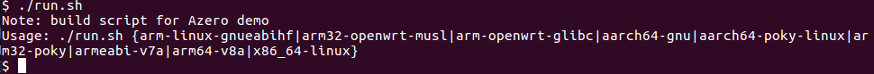
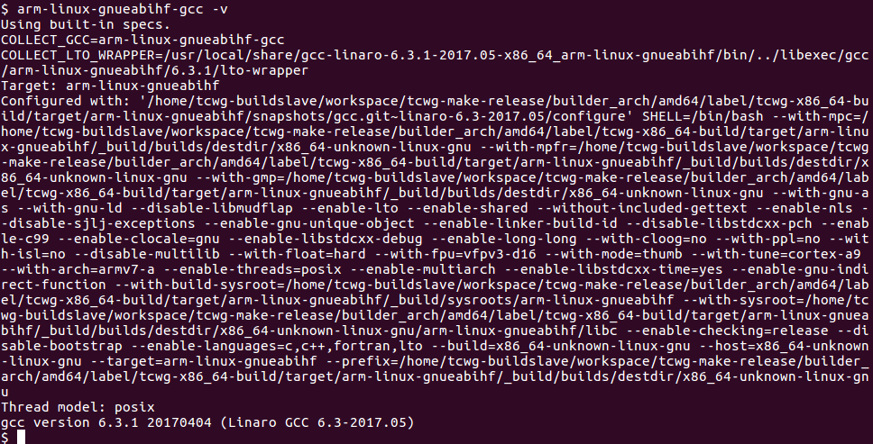
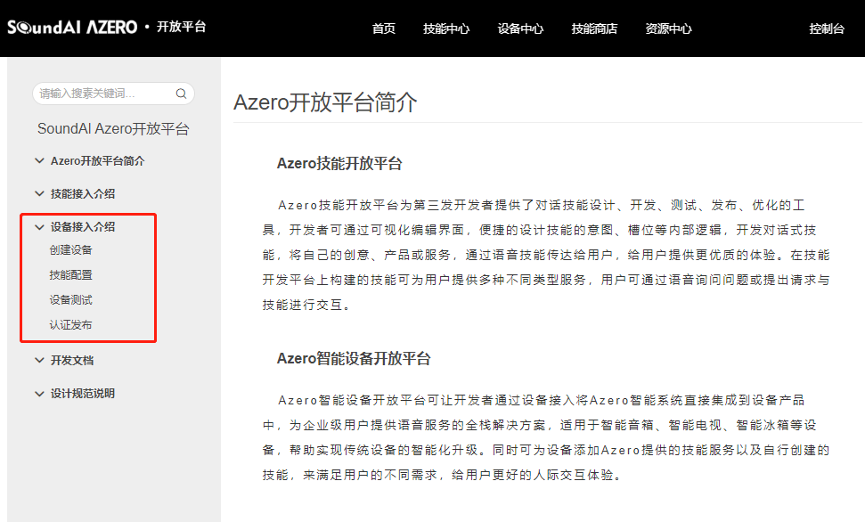
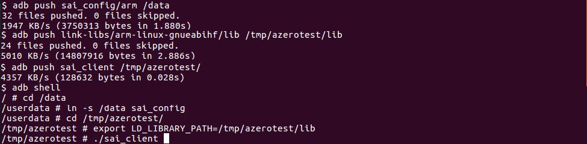
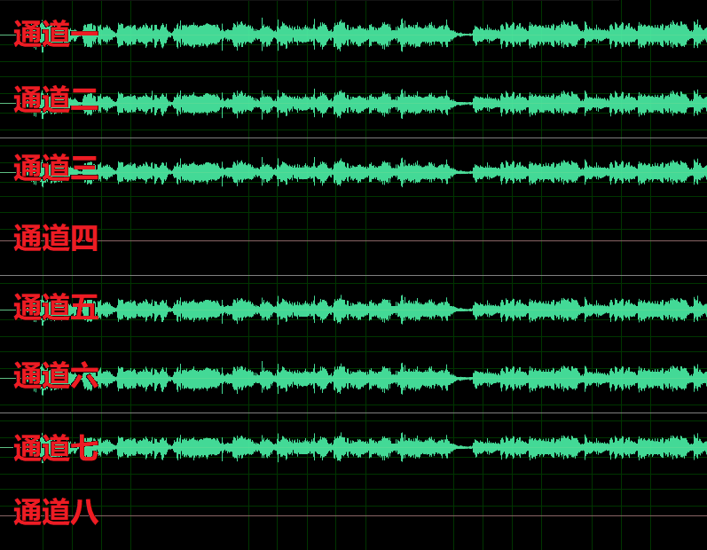
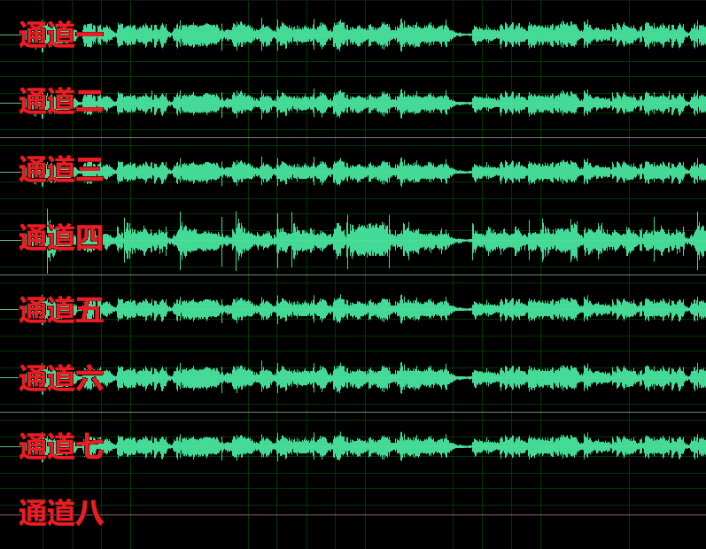
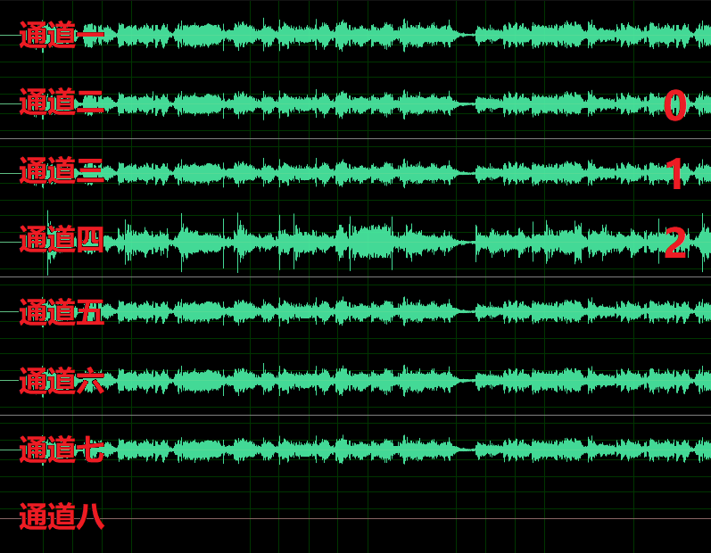
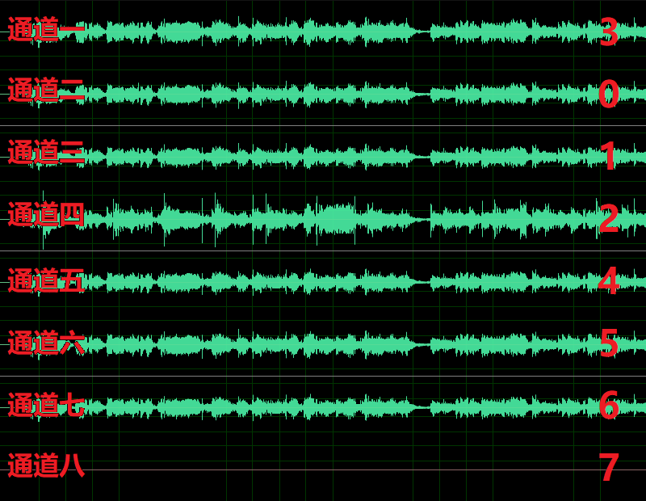

<div align="right">

</div>

# Azero Linux 新手运行说明

## 目录

* [说明](#Description)
* [下载](#Donwload)
* [工程结构](#Contents)
* [编译环境搭建](#Compiled)
* [示例运行](#QuickStart)
* [附录](#Appendix)
    * [通道顺序设置方法](#ChangeChannelMap)
    * [其它文档](#OtherDoc)

## 说明<a id="Description"></a>
此文档负责帮助大家在设备上运行示例，当前支持arm-linux-gnueabihf、aarch64-gnu、Ubuntu x86-64、arm-openwrt-muslgnueabi、arm-openwrt-glibc版本。按照步骤操作可保证示例demo以2mic的形式跑通。

## 下载<a id="Download"></a>
* Github下载：https://github.com/sai-azero/Azero_SDK_for_Linux/releases
* 网盘下载：https://pan.baidu.com/s/1eNPBimZw6UzUNGUyucEfCQ

## 工程结构<a id="Contents"></a>

* sai_config : 配置文件目录，根据版本又分为arm、x86_64-linux目录
* include : Azero SDK的.h文件
* link-libs :  编译示例代码所需的依赖库，目录中分版本放置。
    * lib : Azero SDK库
    * libvlc : SDK依赖的播放器库，默认支持的播放器为VLC
    * 其它 ： 其它类型的播放器，视版本而定
* src : 示例代码
    * main.cpp
* toolchain-cmake ： cmake交叉编译配置文件

## 编译环境搭建<a id="Compiled"></a>

可使用任意一种软件构建工具进行编译环境的搭建。此处默认使用cmake。

#### 环境要求 
* Ubuntu 16.04 LTS x64
* 设备平台对应的编译链
* cmake 及3.5以上

#### arm系版本编译方式<a id="CompilationMethod"></a>
在工程根目录执行run.sh脚本，如下所示：



未加参数运行，会打印出编译命令格式说明。当前已支持的版本有arm-linux-gnueabihf、aarch64-gnu、Ubuntu x86-64、arm-openwrt-muslgnueabi、arm-openwrt-glibc。

根据编译机交叉编译链的安装路径修改toolchain-cmake目录中对应版本的cmake配置文件并配置环境变量。以arm-linux-gnueabihf为例：
1. 假设编译机交叉编译链安装路径为/usr/local/share/gcc-linaro-6.3.1-2017.05-x86_64_arm-linux-gnueabihf。修改toolchain-cmake/arm-linux-gnueabihf-toolchain.cmake文件中的CROSS_COMPILING_ROOT项为上述路径(aarch64-gnu修改toolchain-cmake/aarch64-gnu-toolchain.cmake)。
2. 设置环境变量路径：
```
$export PATH=$PATH:/usr/local/share/gcc-linaro-6.3.1-2017.05-x86_64_arm-linux-gnueabihf/bin
```
3. 设置成功后，执行arm-linux-gnueabihf-gcc -v结果如下图所示代表环境变量配置成功。



4. 在工程根目录执行：
```
$./run.sh arm-linux-gnueabihf
```

若工程根目录生成了示例程序sai_client，则代表编译成功。其它arm系列版本编译链配置方法类似。

#### Ubuntu x86-64 编译运行方法
Ubuntu x86-64编译运行方法略有不同，见[Ubuntu Linux 16.04 LTS (x86_64) 编译指引](./doc/Ubuntu/ubuntu16.04_x86_64_build_guide.md)


## 示例运行<a id="QuickStart"></a>
软件初始化时需要三个参数：clientId、productId以及device_SN(Device Serial Number)。其中，clientId、productId用以标识产品类别，device_SN用以标识个体设备。它们的获取方式如下：

**设备注册**<a id="DeviceRegist"></a>
clientId、productId获取方法：
1. 登录到[Azero开放平台](https://azero.soundai.com)注册账号，账号需进行实名认证。
2. 接下来创建设备，请参考[设备接入介绍](https://azero.soundai.com/docs/document)进行设备注册。



3. 创建完毕后，在“**设备中心**->**已创建设备**”页面可以看到创建的设备，点击对应设备的“查看”进入设备信息页面，页面中的“产品ID”项对应的值即为productId；"Client ID"项对应的值即为clientId。
4. device_SN用来区分设备个体，保证每台唯一即可，一般可使用mac地址。

以上三个参数均在配置文件目录的config.json中进行修改。

**设置参数&运行**
Note：选取的设备需确保arecord可正常录取到音频，录音所需的参数请向设备提供商咨询。
1. 根据设备arecord在示例代码main.cpp的load_plugin_basex函数中设置读取音频相关参数
```c++
    //示例默认采用2 mic运行，此参数无需修改。
    int mic_num = 2;
    
    //读取音频时的通道数，对应arecord的-c项。
    int board_num = 8;
    
    //此参数一般无需修改。
    int frame = 16*16;
    
    //音频设备号，对应arecord的-D项。
    const char *hw = "hw:0,0";

    //通道顺序，设置方法见附录“通道顺序配置方法”。
    char chmap[16] = "0,1,3,4,2,5,6,7";

    //采样位深，对应arecord的-f项。
    SaiMicBaseX_SetBit(handle,16);
    
    //采样率，对应arecord的-r项。
    SaiMicBaseX_SetSampleRate(handle,16000);
    
    //mic信号位移，在采样位深大于16bit时生效，一般取采样位深与16的差值即可。
    SaiMicBaseX_SetMicShiftBits(handle,16);
    
    //回采信号位移，在采样位深大于16bit时生效，一般取采样位深与16的差值即可。
    SaiMicBaseX_SetRefShiftBits(handle,16);
    
    //与设备相关，对应arecord的--period-size项，一般无需修改。
    SaiMicBaseX_SetPeroidSize(handle,512);
    
    //与设备相关，对应arecord的--buffer-size项，一般无需修改。
    SaiMicBaseX_SetBufferSize(handle,4096);
```
2. 在main.cpp中填写clientId、productId与device_SN字段并按照“[编译方式](#CompilationMethod)”编译。其中，clientId与productId通过“[设备注册](#DeviceRegist)”获取，device_SN字段填写此设备独有的字符串即可，一般可以使用mac地址。若clientID与productID填写不正确会使示例程序sai_client初始化时授权不通过。
```c++
    //config customer info
    const char *client_ID = "xxxxxxxx"; //set to your own client
    const char *product_ID = "xxxxxxxx"; //set your owner product ID
    const char *device_SN = "xxxxxxxx"; //set the unique device SN.
    azero_set_customer_info(client_ID,product_ID,device_SN);
```
3. 将编译生成的sai_client、link-libs目录中对应版本的库文件推送到设备中，并按需要配置好库目录中各个库的软链接。例如，我们要在某台设备的/tmp/azerotest下运行示例程序sai_client，并假设这台设备已经默认安装了vlc播放器。
4. 将sai_config目录的文件推送到/data目录下，若data空间有限，可使用软链接的方式将配置文件链接到/data下。
5. 配置好环境变量，运行sai_client即可。
6. 示例程序唤醒词为“小易小易”，音箱给出唤醒提示后，即可说出命令词。例如，“小易小易，播放歌曲”、“小易小易，我想听相声”、“小易小易，今天天气”。

* *sai_config目录config.json文件中，键值为db后缀名的文件是运行时自动生成的文件，其生成位置可自行配置。运行前请确认路径有效。*
* *当前arm系列版本支持的通道数为8,若设备数据通道数小于8需在main.cpp读数据部分自行填充。*



## 附录<a id="Appendix"></a>
#### 通道顺序设置方法<a id="ChangeChannelMap"></a>
之所以需要对通道顺序进行设置是因为不同的设备通道顺序会有差别，通过对通道顺序进行调整确保通道顺序为通道号从小往大“**2路mic信号**+**回采信号**+**其它信号**”的顺序。具体调整方式如下：

1. 保证chmap参数为默认的升序“0,1,2,3,4,5,6,7, ... ”（确保数字总数与设备arecord录音时-c通道参数相同，并且从0开始）, 在/tmp目录下执行如下命令，ls可看到生成了一个大小为0的名为savebasex.pcm的文件。

``` shell
$ touch savebasex.pcm
```
2. 运行编译出的sai_client开始录制，数据会写入到savebasex.pcm中，这时可以对着mic说话或者使用手机外放一段音乐，录制10s左右取出音频文件使用音频软件查看。例如，以8ch的设备为例，录取音频的图如下，其中，通道一、二、三、五、六、七为mic数据，通道四、通道八为空数据：



3. 使设备在播放音乐的同时进行录音，查看音频文件，多出音乐信号的那一路或两路就是回采信号通路。例如，使用aplay播放一段wav音频的同时使用步骤1的方法录音，结果见下图。至此，确定通道一、二、三、五、六、七为mic信号通道，通道四为回采信号通道。



4. 任选取mic信号通道的两路，标记为"0，1"，例如，此处选择通道二、三将其标为0、1，表示将这两路数据放置到通道一和通道二。

5. 将回采通道标记到步骤三确定的mic通道之后。此处，将回采通道四标记为“2”，见下图。



6. 其余通道继续将标记依次增大填充。此示例设备最终的通道顺序为“3,0,1,2,4,5,6,7”。



7. 将计算好的通道顺序填写在chmap配置项中即可。

#### 其它<a id="OtherDoc"></a>

* [Ubuntu Linux 16.04 LTS (x86_64) 编译指引](./doc/Ubuntu/ubuntu16.04_x86_64_build_guide.md)
* [Azero树莓派运行参考](./doc/raspberryPI/raspberryPI_guide.md)

## 更多技能与进阶调优
* 更丰富的技能和个性化定制体验，请到[技能商店](https://azero.soundai.com/skill-store/all-skills)为设备配置官方或者第三方技能，也可以按照[技能接入介绍](https://azero.soundai.com/docs/document)创建自有技能，实现定制化需求。
* 若需将Azero SDK集成到您的工程，并针对您的设备进行唤醒、识别等语音交互效果的调优请参照进阶文档(暂未发布)。