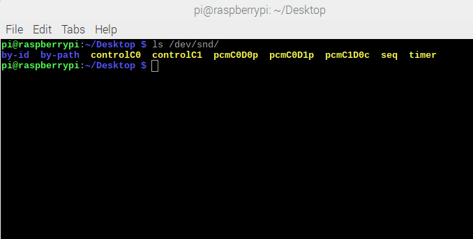

# Azero树莓派运行参考

* [软硬件环境说明](#EnvDescription)
* [开始](#Start)

树莓派是由树莓派基金会研发的一种只有信用卡大小的单板机电脑，拥有非常优秀的扩展性。其价格低廉且易于开发的特性使其成为了众多极客们的玩具。树莓派被开发出了千千万万种玩法，并且普通人也可以轻松实现。此篇文档将为您在树莓派上运行Azero提供参考。在开始前，请先阅读[《Azero Linux 新手运行说明》](../../README.md)。

## 软硬件环境说明<a id="EnvDescription"></a>
硬件版本：树莓派3B+
系统：Raspbian 9.3
软件：Azero arm-linux-gnueabihf版本

## 开始<a id="Start"></a>
#### 声音采集
树莓派本身没有带mic，所以需要外接USB麦克风。此处使用的是声智4mic线型通用阵列，选取2路mic信号做数据输入。


```
$ ls /dev/snd/
```



/dev/snd目录下显示新增加了一个c结尾的录音设备代表链接成功，这时可使用arecord命令进行录音测试：
```
$ arecord -Dhw:1,0 -r 16000 -c 8 -fS16_LE test.wav
```

#### 播放
Azero arm-linux-gnueabihf版本使用VLC作为播放器，Raspbian默认没有带VLC，所以需要手动安装：
```
$ sudo apt-get install vlc
```
raspberryPI 3B+开发板音频输出口只有一个3.5mm母口。可以使用3.5mm耳机调试，也可以使用3.5mm双公音频线外接一个音箱作为播放设备。

#### 运行
1、将mic板接到树莓派板上，确认arecord可录制到数据。（若是使用其它音频输入设备需自行根据音频设备参数确认采音参数），此处使用声智4mic线型阵列，在src/main.cpp中设置参数如下：
```
int mic_num = 2;
int board_num = 8;
int frame = 16*16;
const char *hw = "hw:1,0"; 
char chmap[16] = "0,1,6,7,2,3,4,5";

SaiMicBaseX_SetBit(handle,16);
SaiMicBaseX_SetSampleRate(handle,16000);
SaiMicBaseX_SetMicShiftBits(handle,16);
SaiMicBaseX_SetRefShiftBits(handle,16);
SaiMicBaseX_SetPeroidSize(handle,0);
SaiMicBaseX_SetBufferSize(handle,0);
```

2、根据[《Azero Linux 新手运行说明》](../../README.md)，注册获取clientID与productID，并填写到src/main.cpp中对应的位置，并编译sai_client。

3、将编译成功的sai_client、配置文件以及link-libs/arm-linux-gnueabihf/lib目录传送到树莓派板子上，按照《Azero Linux 新手运行说明》配置好环境变量以及配置文件路径，运行sai_client即可。


